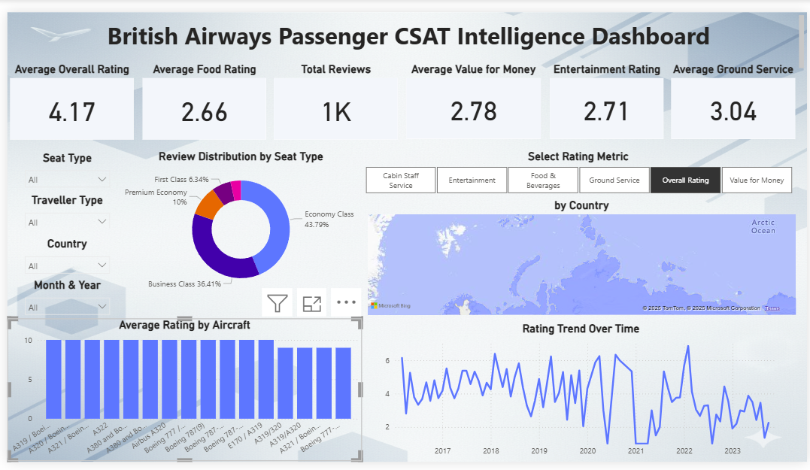

# ✈️ British Airways Passenger CSAT Intelligence Dashboard

  

---

## 📌 Project Overview

The **British Airways Passenger CSAT Intelligence Dashboard** is an end-to-end data visualization project built using **Power BI** to analyze customer satisfaction and service quality based on passenger reviews.

The goal of this project is to help British Airways’ management and PR teams **monitor customer experience**, **identify service gaps**, and **make data-driven decisions** to improve overall passenger satisfaction.

This dashboard is designed to be **interactive, dynamic, and stakeholder-friendly**, allowing users to switch between multiple performance metrics with a single click.

---

## 🎯 Objectives

- Analyze passenger satisfaction trends across different service categories
- Compare ratings by seat type, traveller type, aircraft model, and geography
- Identify strengths and pain areas in airline services
- Enable dynamic metric selection for flexible analysis
- Present insights in a visually intuitive and decision-ready dashboard

---

## 🧩 Datasets Used

### 📂 Dataset 1: `ba_reviews.csv`
- **Rows:** 1,324 passenger reviews
- **Columns:** 19
- **Key Fields:**  
  - Overall Rating  
  - Food, Entertainment, Cabin Staff, Ground Service, Value for Money  
  - Seat Type, Traveller Type, Aircraft  
  - Country, Review Date, Review Content  

### 🌍 Dataset 2: `Countries.csv`
- **Rows:** 251 countries
- **Purpose:** Used for continent and regional mapping to enable geographic filtering and drill-down.

---

## 🔧 Methodology

### 1️⃣ Data Cleaning & Preprocessing
- Corrected data types for rating and date columns
- Handled invalid values using conditional logic (`try … otherwise null`)
- Standardized text fields (Seat Type, Traveller Type, Country)
- Removed noise from text columns while preserving dataset size

### 2️⃣ Data Modeling
- Created a **One-to-Many (1:*) relationship**  
  - `Countries[Country] → ba_reviews[Country]`
- Enabled cross-filtering for country, continent, and region slicers
- Added a **Metric table** to support dynamic metric selection

### 3️⃣ DAX Measures
- Average Overall Rating
- Dynamic Selected Metric measure
- Review Count
- KPI-level calculations for all service categories

### 4️⃣ Data Visualization
- KPI cards for high-level performance summary
- Donut chart for review distribution by seat type
- Dynamic bar charts driven by metric selector
- Map visualization for country-wise review insights
- Line chart to track rating trends over time
- Aircraft-wise performance comparison

---

## 🛠 Tools & Technologies Used

- **Power BI Desktop**
- **Power Query Editor**
- **DAX (Data Analysis Expressions)**
- **Microsoft Excel / CSV files**
- **GitHub (Documentation & Version Control)**

---

## 📊 Key Insights

- Average Overall Rating is **moderately positive**, but not exceptional
- **Food and Value for Money** are the lowest-rated service categories
- Economy and Business Class passengers contribute the majority of reviews
- A380 and A350 aircraft show relatively higher satisfaction scores
- Most reviews originate from the **United Kingdom and United States**
- Customer satisfaction dropped during the pandemic but shows recovery post-2021

---

## 💡 Recommendations

- Improve **meal quality and pricing perception**, especially for long-haul flights
- Focus service enhancements on **Economy and Business Class** passengers
- Replicate best practices from high-performing aircraft models
- Strengthen service quality in high-review regions like the UK & US
- Continuously track CSAT metrics using dynamic dashboards for faster decisions

---

## ⚠️ Limitations & Future Scope

### Limitations
- Review data is subjective and perception-based
- Limited historical data prior to certain years
- Text sentiment analysis not included

### Future Enhancements
- Integrate NLP-based sentiment analysis on review content
- Add predictive CSAT modeling
- Compare British Airways performance with competitor airlines
- Automate data refresh with live survey feeds

---

## ✅ Conclusion

This Power BI dashboard provides a **comprehensive and interactive view of British Airways’ customer satisfaction landscape**.  
By combining strong data modeling, dynamic metrics, and intuitive visual design, this project enables stakeholders to make **actionable, data-backed decisions** that can significantly enhance passenger experience and brand perception.

---

## 👤 Author

**Eshani Sinha**  
Aspiring Data Analyst | Power BI | SQL | Python | Analytics  
📍 India

---

⭐ If you found this project insightful, feel free to give it a star!
